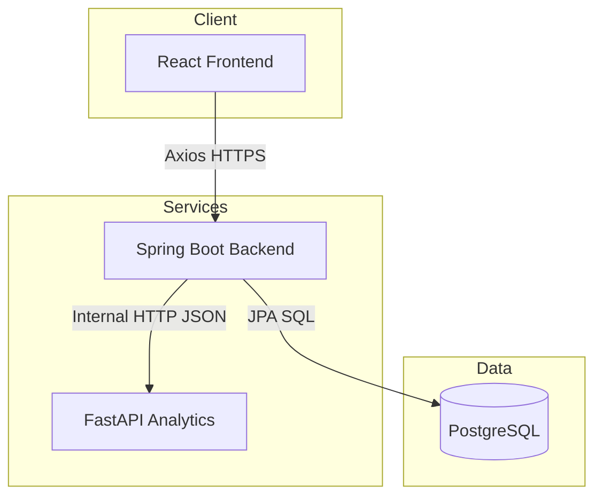

# Overnight

Overnight is a full-stack multi-hotel reservation platform with an internal
analytics service for guest segmentation, review sentiment, and occupancy
forecasting. The project is organized as a monorepo with three applications:
a React frontend, a Spring Boot backend, and a FastAPI analytics service.

Last updated: 2026-09-12.

## Overview

The platform is built around two main goals:

- provide a guest-facing booking experience for browsing hotels, checking
  availability, and creating reservations
- give administrators a single place to manage hotel inventory, reservations,
  guests, and analytics across multiple properties

Analytics are based on real operational data produced by the booking flow.
The backend aggregates reservation and review data, then delegates RFM
segmentation, sentiment scoring, and occupancy forecasting to the internal
Python service.

## Core capabilities

- Public booking flow for browsing hotels, exploring room types, searching by
  date range, and creating reservations
- Admin area with JWT-based authentication for managing hotels, room types,
  rooms, reservations, and guest records
- Analytics dashboard with guest segmentation, sentiment trends, occupancy
  summary, and forecast views
- Polyglot service design where the frontend talks only to the backend, while
  analytics are computed server-to-server behind the API

## Tech stack

- Frontend: React, Vite, React Router, Axios, React-Bootstrap, Recharts
- Backend: Java 21, Spring Boot, Spring Data JPA, Spring Security, Actuator
- Analytics: Python, FastAPI, pandas, scikit-learn, statsmodels
- Database: PostgreSQL
- Local orchestration: Docker Compose
- Deployment: Vercel or Netlify, Render, Supabase
- CI/CD and security: CircleCI and Snyk

## Architecture



The frontend never calls the analytics service directly. The Spring Boot
backend is the single API surface exposed to the browser and coordinates all
analytics requests internally.

## Repository layout

```text
Overnight/
  README.md
  docker-compose.yml
  ARCHITECTURE.md
  Deployment.md
  overnight-frontend/
  overnight-backend/
  overnight-analytics/
```

## Local development

### Docker setup

From the repository root:

```bash
docker compose up --build
```

Local service URLs:

- Frontend: http://localhost:5173
- Backend: http://localhost:8080
- Analytics: http://localhost:8000
- Postgres: localhost:5432

This path uses the local Postgres container and does not require Supabase.

### Manual setup

Run each application in a separate terminal.

Backend:

```bash
cd overnight-backend
mvn spring-boot:run
```

Analytics:

```bash
cd overnight-analytics
pip install -r requirements.txt
uvicorn app.main:app --reload --port 8000
```

Frontend:

```bash
cd overnight-frontend
npm install
npm run dev
```

## Application surface

### Public experience

- Browse hotels and room types
- Filter by destination metadata such as country
- Search room availability by check-in and check-out dates
- Create reservations and submit post-stay reviews

### Admin experience

- Manage hotels, room types, and rooms
- View and update reservation lifecycle states
- Review guest records and reservation history
- Access analytics across all hotels or a selected property

### Analytics features

- RFM guest segmentation
- Review sentiment scoring and trend reporting
- Occupancy summaries and short-term forecasting

## Deployment and CI/CD

A single root `.circleci/config.yml` runs build/test and a Snyk security
scan for all three services (CircleCI only reads config at the repo root,
so each service can't have its own anymore now that this is one repo).

Each service still deploys as its own Render/Vercel project, each pointed
at this monorepo with its own subfolder set as that project's "Root
Directory":

- Frontend: Vercel or Netlify (`overnight-frontend`)
- Backend: Render (`overnight-backend`)
- Analytics: Render (`overnight-analytics`)
- Database: Supabase PostgreSQL

For dependency scanning in CircleCI, configure the `SNYK_TOKEN` environment
variable on the project, and enable "Allow uncertified public orbs" under
Organization Settings → Security (required for the community `snyk/snyk`
orb). See `Deployment.md` for the full walkthrough and the monorepo
migration gotchas.

## Data seeding and reset

The backend seed process only runs when hotel data is absent. If deployed data
needs a full reset before reseeding, truncate the seeded tables and restart the
backend.

```sql
TRUNCATE TABLE
  public.reviews,
  public.reservations,
  public.rooms,
  public.room_types,
  public.hotels,
  public.guests,
  public.admins
RESTART IDENTITY CASCADE;
```

If PostgreSQL reports a prepared statement error in pooled environments, keep
the datasource configuration that disables server-side prepared statements.

## Documentation

- `ARCHITECTURE.md` for service boundaries, runtime flow, and repo structure
